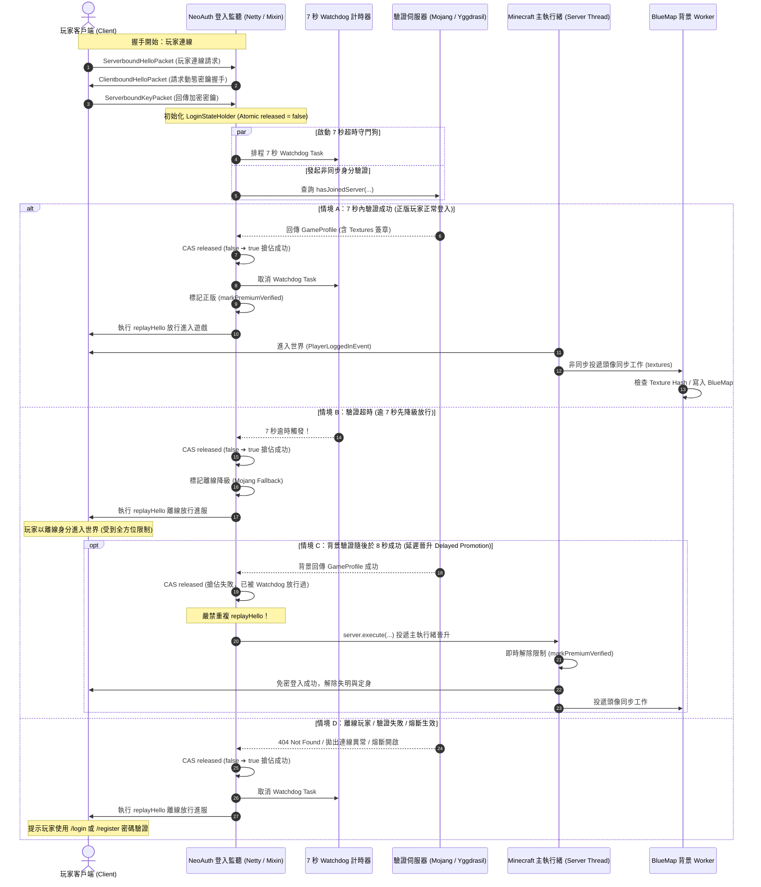
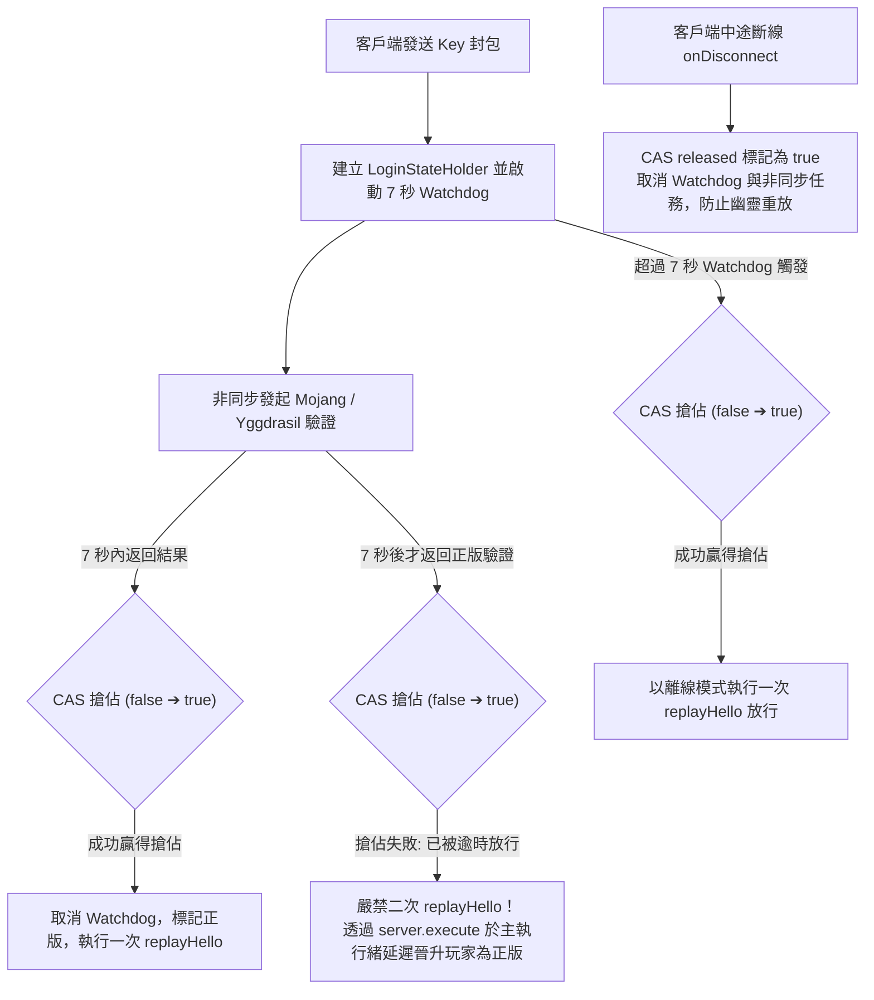
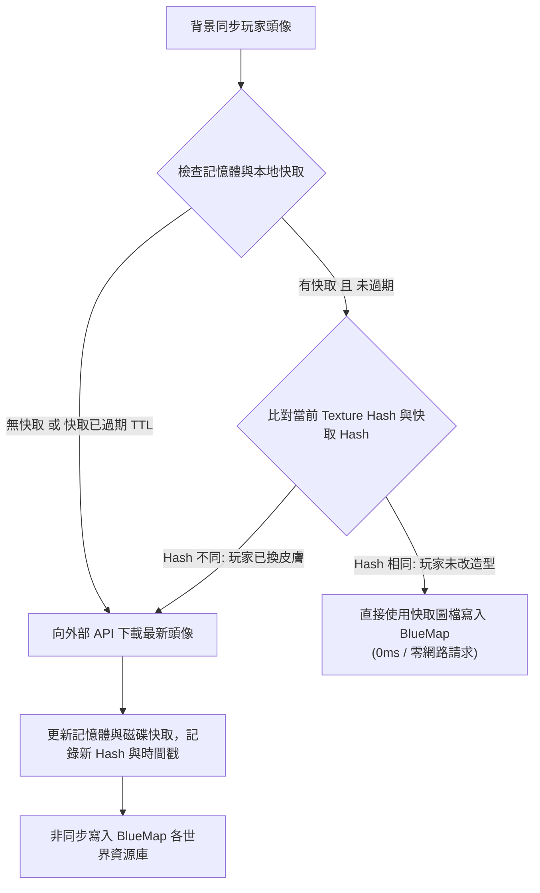

# 🔐 NeoAuthReloaded

<div align="center">

**輕量級 Minecraft 伺服器登入驗證模組**  
同時支援 **Minecraft 1.20.1 (Forge)** 與 **Minecraft 1.21.1 (NeoForge)**

</div>

---

本專案大量借鑒 **AuthMeReloaded** 的風格與傳統設計，重新復刻出 **NeoAuthReloaded** 模組，並提供 AuthMeReloaded 沒有提供的 Forge 與 NeoForge 模組支援。採用的資料庫相容於原 AuthMe 的資料庫結構，並支援使用原 AuthMe 的資料庫，讓原本使用 AuthMe 的服主可以直接無縫切換到 NeoAuthReloaded。設定檔風格也比照 AuthMeReloaded 設計，讓原本使用 AuthMe 的服主能快速上手。

### 核心優勢亮點：
- **全模式正版自動登入 (Dynamic Premium Handshake)**：無論伺服器處於 `online-mode: false` 還是 `online-mode: true`，正版玩家皆能經由 Mojang Session 驗證，**享有完全免輸入密碼的絲滑自動登入體驗**！
- **離線模式存檔零重設 (Zero-Wipe Guarantee)**：在 `online-mode: false` 下所有玩家統一採用離線 UUID (v3)，玩家從離線升級正版或遇到 Mojang 官方斷線時，背包存檔與進度永遠 100% 相同且永不重設！
- **多平台無縫支援**：單一核心架構同時支援主流模組載入器 **Minecraft 1.20.1 (Forge)** 與 **Minecraft 1.21.1 (NeoForge)**。
- **無縫接軌 AuthMeReloaded**：資料庫結構與加密格式（加鹽 SHA-256、BCrypt 等）100% 相容 AuthMe，舊有伺服器資料庫（SQLite / MariaDB / MySQL）可無痛平滑遷移。

---

## 📊 `online-mode` 雙模式特性對照表

NeoAuthReloaded 支援原廠 `server.properties` 中的兩種連線模式，服主可依據伺服器型態自由選擇：

| 伺服器模式 (`online-mode`) | 適用場景 | UUID 機制 | 皮膚載入途徑 | 正版玩家體驗 | 離線玩家體驗 | 存檔安全性 (Playerdata) |
| :--- | :--- | :--- | :--- | :--- | :--- | :--- |
| **`online-mode: false`**<br>*(混合服/模組服推薦首選)* | 離線服<br>正版/離線混合服 | 所有玩家統一使用<br>**離線 UUID (v3)** | 由伺服端皮膚模組<br>(如 SkinRestorer) 自動抓取與同步 | **✅ 免密碼自動登入**<br>(NeoAuth 動態密鑰握手) | ✅ 提示密碼登入或註冊<br>(`/login` 或 `/register`) | 🛡️ **最高**：所有存檔永遠綁定唯一離線 UUID，升級正版或官方斷網永不掉檔！ |
| **`online-mode: true`**<br>*(純官方原生模式)* | 原生正版伺服器 | 正版為 Mojang UUID (v4)<br>離線為離線 UUID (v3) | Minecraft 官方客戶端<br>原廠自動下載 | **✅ 免密碼自動登入**<br>(原生 Mojang 驗證) | ✅ 透過 `allowOfflinePlayers`<br>放行並提示密碼驗證 | 需注意正版/離線切換時因 UUID 不同造成的背包存檔分離。 |

---

## 🌟 模組特色

- **雙平台架構抽象化**：基於模組化設計，一套核心邏輯 (`neoauth-core`) 同時驅動 **Forge 1.20.1** 與 **NeoForge 1.21.1**。
- **動態正版加密握手 (On-Demand Premium Handshake)**：
  - 在 `online-mode: false` 離線伺服器下，自主生成 RSA 加密金鑰並動態發起 Mojang 密鑰握手（`ClientboundHelloPacket`）。
  - **正版玩家免密碼自動登入**：通過 Mojang Session 驗證後直接自動登入，無需輸入密碼，提供最順暢的原生遊玩體驗。
- **BlueMap 網頁地圖正版/外置站頭像自動同步**：
  - 完美彌平 `online-mode: false` 下分配離線 UUID 所造成的 BlueMap 頭像 404 斷層。
  - 當玩家通過官方正版或外置皮膚站驗證時，背景非同步下載 64x64 頭像並自動寫入 BlueMap 各世界地圖資源庫 (`assets/playerheads/<offlineUuid>.png`)，網頁端即時呈現正版頭像。
  - 支援自架皮膚站（如 Blessing Skin、authlib-injector）頭像網址設定與多來源智慧備援。
- **開箱即用 SQLite & 高效能連線池**：
  - 預設提供零配置的 SQLite 支援（檔案位於 `config/neoauth/neoauth.db`），支援相對路徑跨目錄讀取舊 AuthMe 檔案。
  - 支援 MariaDB 與 MySQL，透過 HikariCP 高效連線池進行執行緒安全的資料操作（SQLite 啟用 WAL 高效並行模式）。
- **AuthMeReloaded 100% 無縫相容**：資料表結構與欄位均相容於 AuthMeReloaded (`authme.db` 或 SQL 資料庫)，加密格式支援雙重加鹽 SHA-256、BCrypt 等。
- **全方位登入前防護**：
  - 🚫 **對話隔離**：未登入玩家無法在聊天頻道發言。
  - 🚫 **指令白名單**：未登入玩家僅可執行白名單指令 (`/login`, `/register`, `/l`, `/reg` 等)。
  - 🚫 **世界防護**：全面禁止方塊破壞、放置、點擊箱子/工作台、丟棄物品與實體互動。
  - 🛡️ **傷害保護**：未登入玩家無法受到任何傷害，亦無法攻擊其他玩家或生物。
  - 🧊 **原地凍結**：自動套用高強度定身效果（緩速、跳躍抑制、失明），防止未驗證玩家移動或窺探地圖。
- **多國語言 (i18n) 與熱重載**：
  - 採用 `config/neoauth/` 資料夾架構，包含 `config.yml`、`commands.yml`、`welcome.txt` 與 `messages/` 目錄。
  - 內建正體中文 (`zhtw`) 與英文 (`en`) 語言檔與幫助指南。
  - 支援熱重載指令 `/neoauth reload`。

---

## 🏗️ 核心架構與深度防護技術規格 (Architecture & Deep Security)

### 🔐 1. 登入穩定度改良與架構重構 (Login Pipeline & Stability)

本機制針對正版玩家連線中斷、握手卡頓（如外部網路延遲造成的數十秒卡頓）以及狀態機重複重放引發的競態條件進行深度修復與架構重構。

#### 痛點背景與解決思路
- **原版/舊版痛點**：
  1. 握手階段同步執行 Mojang 驗證與 BlueMap 頭像下載寫入，導致握手時間過長（2~32 秒），客戶端極易握手逾時斷線。
  2. Watchdog 逾時降級與背景非同步驗證同時運行時，缺乏互斥控制，兩者皆可能觸發 `replayHello` 導致封包重複發送，破壞 Netty Channel 狀態。
- **重構架構核心**：
  - **原子狀態機 (Atomic State Machine)**：維護 `LoginStateHolder`，使用 `AtomicBoolean released` 進行 CAS 原子搶佔，**確保 `replayHello` 於單一連線中絕對僅執行恰好一次**。
  - **非核心工作背景化**：BlueMap 網頁地圖頭像下載與寫入徹底移出連線握手，移至玩家進入世界後由專屬 Daemon 背景執行緒非同步處理。

#### 登入認證完整循序圖表 (Login Sequence Diagram)



#### 狀態機原子控制決策流程圖 (Race-Free Pipeline Flowchart)



#### 7 秒動態驗證逾時與延遲晉升 (Delayed Promotion)
- **7 秒守門機制**：在 `config.yml` 中預設 `settings.dynamicVerificationTimeout: 7`。當外部驗證伺服器網路壅塞或反應緩慢超過 7 秒時，伺服器先以離線模式放行玩家進服，客戶端無感連線、不卡在載入畫面。
- **延遲晉升 (Delayed Promotion)**：若背景查詢於數秒後成功回傳，伺服器主執行緒將自動執行「延遲晉升」：
  - 玩家若仍在線且尚未完成手動密碼登入，系統即刻將其標記為已驗證正版玩家。
  - 自動解除失明、定身與移動限制，並補齊正版皮膚屬性。

#### Mojang 驗證伺服器狀態熔斷保護 (Circuit Breaker)
- **智慧狀態熔斷**：當 Mojang Session 伺服器發生大範圍故障、連線超時或異常拋錯時，系統自動啟動熔斷保護機制（冷卻時間預設 180 秒）。
- **零中斷平滑切換**：處於熔斷期間時，伺服器**完全不向連線客戶端發送加密握手請求**，客戶端直接以離線流程順暢進服，徹底避免客戶端因嘗試連線掛掉的 Mojang 服務而出現「登入失敗：目前無法連線到驗證伺服器」並主動斷線。
- **進服提示**：熔斷生效期間進服之玩家，系統自動發送提示訊息引導改用密碼登入（`/login`）。可透過管理員指令 `/neoauth circuitbreaker` 隨時查看狀態、重置或手動測試觸發。

#### BlueMap 背景解耦與三層頭像快取機制 (Avatar Cache Specification)
- **解耦核心**：Mojang 握手階段僅會回傳包含皮膚 URL 的 `textures` 中繼資料，**絕不包含 2D PNG 頭像圖檔**。下載 64×64 PNG 與寫入多個世界地圖目錄改交由背景專屬單執行緒佇列（`NeoAuth-BlueMap-Worker`）依序執行，對遊戲主執行緒與 Netty 網路迴圈達到 **0 毫秒阻塞**。
- **與 SkinRestorer 協同**：在 `PlayerLoggedInEvent (priority = EventPriority.HIGHEST)` 階段，NeoAuth 率先將通過驗證之 `textures` 注入玩家實體的 `GameProfile`。當下游的 `SkinRestorer` 模組讀取到玩家已具備正版皮膚材質時，會直接沿用現有外觀，不觸發多餘的外部網路請求，避免多模組衝突與競態。
- **三層快取更新防護**：
  1. **Texture Hash 指紋比對（最強即時性）**：記錄 `textures` 屬性的 SHA-256 雜湊。即使快取尚未過期，一旦玩家在官方更換皮膚，登入時因 Hash 改變，快取即刻失效並觸發自動重新下載，換造型即時生效。
  2. **TTL 存活時間（預設 120 分鐘）**：在 `config.yml` 中配置 `bluemap.cacheTtlMinutes: 120`，離線玩家或固定外觀玩家於時間內直接命中記憶體快取，0 網路請求、0 磁碟負擔。
  3. **熱重載與指令手動清理**：執行 `/neoauth reload` 時自動調用 `BlueMapIntegration.clearCache()` 清空快取。



---

### 🛡️ 2. 未登入狀態物品欄與容器深度防護 (Inventory & Container Security)

為解決未登入玩家（正版未驗證 / 離線未登入 / 未註冊訪客）可能透過客戶端原版特性、模組快捷鍵、方塊互動或地面掉落物進行非法操作或物品轉移的安全性漏洞，NeoAuthReloaded 導入了「封包底層 + 模組事件層」的雙層立體防護架構。

#### 漏洞成因與安全威脅
1. **原版個人背包 (E 鍵)**：開啟個人物品欄（Container ID 0）純屬客戶端本地行為，不發送開啟封包。點擊拖曳或換裝時，客戶端向伺服器發送點擊與動作封包。若伺服端未嚴格攔截，可能導致物品被違規移動或寫入存檔。
2. **模組背包 (Sophisticated Backpacks 等)**：玩家透過按鍵綁定或快捷鍵開啟背部裝備的模組背包時，模組會在伺服端為玩家開啟 `ContainerMenu`，繞過了傳統的方塊點擊判定。
3. **地面掉落物與副手偷渡**：未登入玩家走過地面物品時會自動吸取；按 F 鍵交換主副手或按 Q 鍵丟棄物品時，伺服端若無封包重置與數據同步，易造成客戶端產生幽靈物品（Ghost Items）或物品被非法拋擲轉移。

#### 雙層立體防護架構實作

NeoAuthReloaded 在 **Forge 1.20.1** 與 **NeoForge 1.21.1** 雙平台同步實作：

##### 1. 封包層攔截 (Packet-Level Interception - Mixin 注入 `ServerGamePacketListenerImpl`)
在最底層封包監聽器攔截未登入玩家的所有物品相關操作，並透過伺服端權威同步徹底消除客戶端畫面幽靈殘留：

* **`handleContainerClick` (容器/背包槽位點擊)**：
  - 檢測玩家登入狀態，未登入者直接取消執行（`ci.cancel()`）。
  - 若玩家開啟了非個人預設物品欄的容器，立即強制執行 `player.closeContainer()` 關閉視窗。
  - 調用 `containerMenu.sendAllDataToRemote()` 與 `inventoryMenu.sendAllDataToRemote()`，強制向客戶端推送伺服端真實槽位與鼠標手持數據，物品位置立刻回彈復原。
* **`handleContainerButtonClick` (容器按鈕點擊)**：
  - 攔截切石機、附魔台、信標、合成台等 GUI 內部的所有按鈕點擊封包。
* **`handleContainerSlotStateChanged` (NeoForge 1.21+ 槽位狀態變更)**：
  - 阻擋 1.21+ 全新槽位狀態切換。
* **`handlePlayerAction` (玩家動作封包)**：
  - 嚴格攔截 `SWAP_ITEM_WITH_OFFHAND`（按 F 交換主副手）。
  - 嚴格攔截 `DROP_ITEM` 與 `DROP_ALL_ITEMS`（按 Q 丟棄物品），並即時回傳物品欄真實數據。
* **`handleSetCreativeModeSlot` (創造模式槽位修改)**：
  - 取消未驗證玩家在創造模式下憑空獲取或竄改物品欄槽位。
* **進階交互封包全面攔截**：
  - `handlePlaceRecipe`：阻擋配方書自動合成與材料放置。
  - `handleSelectTrade`：阻擋與村民的交易項目選取。
  - `handleRenameItem`：阻擋鐵砧更名與修理。
  - `handlePickItem`：阻擋中鍵拾取方塊至快捷列。

##### 2. 事件層防護 (Event-Level Interception - 模組事件監聽)
在生命週期與物理世界層面建立外圍防禦：

* **`PlayerContainerEvent.Open` (容器開啟防護)**：
  - 當任何模組（如精妙背包 Sophisticated Backpacks）或方塊試圖在伺服端為未登入玩家開啟外部容器 GUI 時，事件處理器立即呼叫 `player.closeContainer()` 強制關閉，杜絕 GUI 被開啟的可能性。
* **`EntityItemPickupEvent` (Forge) / `ItemEntityPickupEvent.Pre` (NeoForge) (地面拾取防護)**：
  - 當未登入玩家走過地面掉落物時，直接拒絕拾取（`event.setCanceled(true)` 或 `event.setCanPickup(TriState.FALSE)`），防止未登入玩家吸取或撿拾任何地面物資。

#### 全方位安全防護矩陣對照表

| 操作行為 | 觸發路徑 | 防禦層級 | 處置方式 | 防護效果 |
| :--- | :--- | :--- | :--- | :--- |
| **開啟個人背包點擊物品 (E 鍵)** | 客戶端發送點擊封包 | 封包層 (`handleContainerClick`) | 取消封包 + `sendAllDataToRemote()` | 物品即刻彈回原位，禁止移動、裝備與整理 |
| **開啟箱子/熔爐/工作台** | 玩家與方塊互動 | 事件層 + 封包層 | 取消方塊互動 + `closeContainer()` | 容器無法開啟，若強開則立即被伺服器強制關閉 |
| **模組背包快捷鍵 (精妙背包等)** | 模組發起開啟請求 | 事件層 (`PlayerContainerEvent.Open`) | 立即執行 `player.closeContainer()` | 模組背包視窗無法開啟，完全無法存取內容物 |
| **按 F 鍵交換副手物品** | `SWAP_ITEM_WITH_OFFHAND` | 封包層 (`handlePlayerAction`) | 取消動作 + 回傳槽位同步 | 副手與主手物品維持原樣，無法切換 |
| **按 Q 鍵丟棄物品** | `DROP_ITEM` / `DROP_ALL_ITEMS` | 封包層 (`handlePlayerAction`) | 取消動作 + 回傳槽位同步 | 物品無法扔出，禁止向外界轉移物資 |
| **走過地面掉落物** | 實體碰撞拾取 | 事件層 (`ItemPickupEvent`) | 取消拾取權限 (`setCanPickup: FALSE`) | 玩家直接穿過掉落物，物品不會被吸入背包 |
| **村民交易 / 鐵砧 / 切石機** | 特殊容器封包 | 封包層 (`handleSelectTrade` 等) | 全面取消動作封包 | 無法選取交易配方、無法消耗經驗或物品 |
| **創造模式物品生成/修改** | `SetCreativeModeSlot` | 封包層 (`handleSetCreativeModeSlot`) | 取消封包並覆寫還原 | 無法透過創造模式封包竄改背包槽位 |

---

## 📥 安裝步驟 (Installation)

### 步驟 1：下載並安裝模組
1. 依據您的伺服器端核心與版本，下載對應的 JAR 檔案：
   - **Minecraft 1.20.1 (Forge)**：`neoauth-forge-1.20.1-<version>.jar`
   - **Minecraft 1.21.1 (NeoForge)**：`neoauth-neoforge-1.21.1-<version>.jar`
2. 將下載的 JAR 檔案放入伺服器根目錄下的 `mods/` 資料夾中。

---

### 步驟 2：伺服器模式設定 (`server.properties`)
NeoAuthReloaded 支援兩種運作模式：
* **推薦模式（混合服/模組服）**：
  ```properties
  online-mode=false
  ```
  所有玩家統一採用離線 UUID 存檔（永不掉檔），正版玩家自動免密登入，皮膚交由 SkinRestorer 模組接管。
* **原生線上模式**：
  ```properties
  online-mode=true
  ```
  正版玩家採用 Mojang 原生 UUID 登入，離線玩家由 NeoAuth 放行。

---

## ⚙️ 設定檔說明 (Configuration)

伺服器首次啟動後，將會在伺服器根目錄的 `config/` 資料夾下自動建立目錄結構：

```
config/neoauth/
 ├── commands.yml          # 指令白名單與登入/註冊/登出時自動執行之指令掛鉤
 ├── config.yml            # 主設定檔 (資料庫連線、密碼規則、防護限制、語言切換等)
 ├── welcome.txt           # 玩家進服顯示之彩色歡迎公告 (支援 {PLAYER} 變數與顏色代碼)
 └── messages/             # 多國語言訊息與幫助指南目錄
     ├── help_en.yml       # 英文幫助說明
     ├── help_zhtw.yml     # 正體中文幫助說明
     ├── messages_en.yml   # 英文系統提示訊息
     └── messages_zhtw.yml # 正體中文系統提示訊息
```

### `config.yml` 重點設定一覽：
- `DataSource.backend`：資料庫後端類型，預設 `SQLITE`（開箱即用），亦可設定為 `MARIADB` 或 `MYSQL`。
- `DataSource.sqLiteFile`：SQLite 資料庫檔案路徑，預設 `config/neoauth/neoauth.db`，支援相對路徑（如 `../plugins/AuthMe/authme.db`）與絕對路徑。
- `DataSource`：配置 MariaDB / MySQL 連線主機、埠號、資料庫帳密、資料表名稱與連線池參數。
- `settings.messagesLanguage`：設定提示訊息語言，預設 `zhtw` (正體中文)，可設為 `en` (英文)。
- `settings.allowOfflinePlayers`：是否允許離線（非官方）玩家在線上模式伺服器進入並進行帳密驗證（預設 `true`）。
- `settings.dynamicPremiumVerification`：是否在離線模式 (`online-mode: false`) 下啟用動態正版驗證（預設 `true`）。開啟時，正版玩家將自動經由握手享有免密碼自動登入。
- `settings.customYggdrasilUrl`：自訂第三方 Yggdrasil 外置驗證伺服器 API 網址（例如 `"https://mc8.yuaner.tw/api/yggdrasil"`）。設定後 NeoAuth 原生支援「雙向雙驗證」：優先驗證 Mojang 官方正版，若非 Mojang 帳號則自動向此外置站驗證 Session，無論是官方正版或外置正版皆享有免密自動登入，伺服端無需掛載任何 JavaAgent！
- `settings.registration`：AuthMeReloaded 相容註冊設定區塊：
  - `enabled`：是否開放遊戲內註冊 (`/register`)，預設 `true`。若關閉 (設為 `false`)，則玩家僅能於外部網站或論壇註冊帳號。
  - `messageInterval`：未驗證玩家定期提示間隔秒數（預設 `5` 秒）。
  - `force`：是否強制玩家註冊/登入（設為 `false` 允許未註冊訪客自由遊玩）。
  - `forceKickAfterRegister`：註冊成功後是否直接踢出伺服器（預設 `false`）。
  - `forceLoginAfterRegister`：註冊成功後是否強制要求重新執行 `/login`（預設 `false`）。
- `settings.security`：密碼最短與最長長度設定、密碼雜湊方式 (SHA256 / BCRYPT 等)。
- `settings.restrictions`：登入超時、錯誤密碼次數限制、定身失明與緩速效果開關、歡迎公告顯示開關。
- `bluemap`：BlueMap 網頁地圖頭像自動整合設定區塊：
  - `enabled`：是否啟用 BlueMap 正版/外置站玩家頭像自動下載與同步（預設 `true`）。
  - `useSkinRestorerConfig`：是否自動連動讀取 SkinRestorer 設定檔（`config/skinrestorer/config.json` 等），自動提取自架皮膚站並遵循其優先順序（預設 `true`，未安裝時自動回退獨立設定）。
  - `priority`：獨立模式下的頭像來源優先順序（`OFFICIAL_FIRST` 官方優先 / `CUSTOM_FIRST` 自架站優先，預設 `OFFICIAL_FIRST`）。
  - `avatarUrl`：官方正版頭像下載來源 API 網址範本（預設 `"https://mc-heads.net/avatar/{username}/64"`）。
  - `customAvatarUrl`：自架第三方皮膚站 / Blessing Skin 外置頭像來源 API 範本（例如 `"https://mc8.yuaner.tw/avatar/player/{username}?size=64"`）。

---

## 🛠️ 建置步驟 (Build Instructions)

```bash
# 建置全部平台版本 (產出至 build/libs/)
./gradlew buildAll

# 僅建置 Forge 1.20.1
./gradlew buildForge

# 僅建置 NeoForge 1.21.1
./gradlew buildNeoForge
```

---

## 🎮 遊戲內指令 (In-Game Commands)

### 👤 玩家指令 (Player Commands)

| 指令 | 別名 | 權限需求 | 說明 | 範例 |
| :--- | :--- | :--- | :--- | :--- |
| `/login <password>` | `/l` | 全體玩家 | 進行帳號登入驗證 | `/login myPassword123` |
| `/register <password> [confirm]` | `/reg` | 全體玩家 | 註冊新帳號 | `/register myPassword123 myPassword123` |
| `/changepassword <old> <new> <confirm>` | `/cp` | 已登入玩家 | 修改當前帳號密碼（含二次確認） | `/changepassword old123 new456 new456` |
| `/logout` | - | 已登入玩家 | 登出當前帳號並重新套用防護 | `/logout` |
| `/email` | `/email show` | 已登入玩家 | 查看當前帳號綁定的電子信箱 | `/email` |
| `/email set <newEmail>` | - | 已登入玩家 | 綁定或更新當前帳號的電子信箱 | `/email set player@example.com` |
| `/lastlogin` | - | 已登入玩家 | 查詢自己最後登入時間與註冊日期 | `/lastlogin` |
| `/getip` | - | 已登入玩家 | 查詢自己目前的連線 IP 位址 | `/getip` |

---

### 🛡️ 管理員指令 (Admin Commands - `/neoauth`)

> 所有 `/neoauth` 管理指令皆需要管理員權限 (OP 等級 2 以上)。

| 子指令 | 參數 | 說明 | 範例 |
| :--- | :--- | :--- | :--- |
| `/neoauth help` | `[query]` | 顯示管理員指令幫助清單 | `/neoauth help` |
| `/neoauth register` | `<player> <password>` | 強制為指定玩家註冊帳號 | `/neoauth register Steve pass123` |
| `/neoauth forcelogin` | `[player]` | 強制登入指定玩家（未填則為自己） | `/neoauth forcelogin Steve` |
| `/neoauth password` | `<player> <newPassword>` | 強制變更指定玩家的密碼（別名 `changepassword`, `pass`） | `/neoauth password Steve newPass123` |
| `/neoauth lastlogin` | `[player]` | 查詢指定玩家的最後登入時間、IP 與註冊日期 | `/neoauth lastlogin Steve` |
| `/neoauth accounts` | `[player \| IP]` | 查詢與指定玩家名稱或 IP 關聯的所有同 IP 帳號 | `/neoauth accounts Steve` |
| `/neoauth email` | `[player]` | 查詢指定玩家設定的電子信箱 | `/neoauth email Steve` |
| `/neoauth email set` | `<player> <email>` | 為指定玩家設定或更新電子信箱（別名 `/neoauth setemail`） | `/neoauth email set Steve steve@example.com` |
| `/neoauth getip` | `<player>` | 查詢指定玩家的 IP 位址（線上或最後紀錄） | `/neoauth getip Steve` |
| `/neoauth setenableregister` | `<true \| false>` | 動態切換是否開放遊戲內註冊，並自動保存至 `config.yml` | `/neoauth setenableregister false` |
| `/neoauth reload` | - | 熱重載所有設定檔 (`config.yml`, `commands.yml`, `welcome.txt`) 與訊息檔 | `/neoauth reload` |
| `/neoauth version` | - | 顯示 NeoAuth 模組版本與目前運行的平台 (Forge / NeoForge) | `/neoauth version` |
| `/neoauth recent` | - | 顯示伺服器最近登入的玩家清單與登入時間 | `/neoauth recent` |

---

## 📄 授權條款 (License)

本專案採用 [GPLv3](LICENSE) 條款開源發布。
